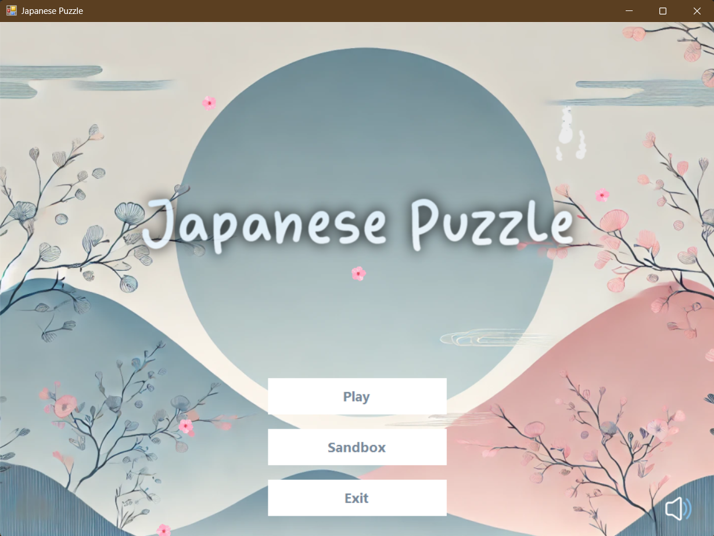

# Japanese Puzzle

**Japanese Puzzle** is a Windows Forms application developed using the .NET Framework. It offers an immersive experience of creating and solving Japanese crosswords (nonograms). The application features dynamic visuals, background music, and a user-friendly interface.



## Features

- **Create and Solve Nonograms**: Design your own Japanese crosswords or challenge yourself with pre-existing puzzles.
- **Persistent Progress**: Your puzzle-solving progress is automatically saved, allowing you to resume at any time.
- **Dynamic Visuals**: Enjoy a visually appealing interface with falling sakura petals enhancing the ambiance.
- **Background Music**: Immerse yourself with background music powered by NAudio, with the ability to pause or resume at your convenience.
- **Responsive Design**: The application's layout adapts seamlessly to window resizing, ensuring optimal user experience across different screen sizes.
- **Puzzle Management**:
  - Puzzles are stored in JSON format, facilitating easy management and scalability.
  - On startup, the application checks for the existence of `puzzles.json`. If absent, it generates the file with predefined puzzles.
- **User-Friendly Navigation**:
  - Main menu with options to play, edit puzzles, or exit the application.
  - Difficulty selection menu showcasing illustrative previews of puzzles.
  - Puzzle list displays unsolved puzzles first, followed by solved ones.
  - Navigation buttons allow smooth transition between puzzles, with visibility toggled based on the current puzzle's position in the list.
- **Puzzle Creation Constraints**:
  - Prevents saving of empty puzzles.
  - Requires a name for each puzzle before saving.
  - Upon saving, a confirmation message indicates the puzzle is saved under the "Easy" difficulty level.

## Technologies Used

- **.NET Framework**: Windows Forms for the graphical user interface.
- **NAudio**: Handles audio playback functionalities.
- **Newtonsoft.Json**: Manages JSON serialization and deserialization for puzzle data.

## Installation

1. **Clone the Repository**:
   ```bash
   git clone https://github.com/AnnMarko/Japanese-Puzzle.git
   ```
2. **Open in Visual Studio**:
   - Ensure you have Visual Studio installed with .NET desktop development workload.
   - Open the solution file `Japanese-Puzzle.sln`.
3. **Restore NuGet Packages**:
   - Navigate to `Tools` > `NuGet Package Manager` > `Manage NuGet Packages for Solution...`.
   - Restore the following packages:
     - `NAudio`
     - `Newtonsoft.Json`
4. **Build and Run**:
   - Set the startup project to `JapanesePuzzle`.
   - Press `F5` to build and run the application.

## Usage

- **Main Menu**:
  - Click "Play" to choose a difficulty level and start solving puzzles.
  - Click "Edit" to create a new puzzle.
  - Click "Exit" to close the application.
- **Solving Puzzles**:
  - Select a puzzle from the list.
  - Use the grid to fill in cells based on the clues.
  - Progress is saved automatically when returning to the main menu.
  - Upon completion, a victory message is displayed.
- **Creating Puzzles**:
  - Design your puzzle by filling in the grid.
  - Provide a name for your puzzle.
  - Click "Save" to add it to the "Easy" difficulty level.
